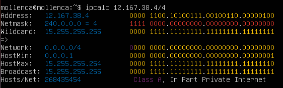
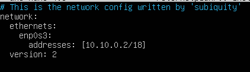
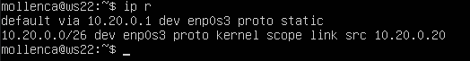
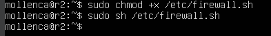

## Part 1. Инструмент ipcalc  
### 1.1. Сети и маски  
#### 1) Адрес сети 192.167.38.54/13  
* Для вывода адреса сети пользуюсь утилитой ipcalc, которую предварительно скачала командой `sudo apt install ipcalc`.  
Далее ввожу команду `ipcalc -b 192.167.38.54/13`  
   
Флаг `-b` позволяет скрыть двоичный вывод.  

#### 2) Перевод маски 255.255.255.0 в префиксную и двоичную запись, /15 в обычную и двоичную, 11111111.11111111.11111111.11110000 в обычную и префиксную  
* Использую команду `ipcalc 255.255.255.0`  
    
Префиксная запись `/24`. Двоичная запись - `11111111.11111111.11111111.00000000`  

* Использую команду `ipcalc /15`  
   
Обычная запись - `255.254.0.0`. Двоичная запись - `11111111.11111110.00000000.00000000`  

  
* Считаю  количество ненулевых бит в 11111111.11111111.11111111.11110000, получила - 28. Использую команду `ipcalc 192.167.38.54/28`  
   
Обычная запись - `255.255.255.240`. Префиксная запись - `/28`.  

#### 3) Минимальный и максимальный хост в сети 12.167.38.4 при масках: /8, 11111111.11111111.00000000.00000000, /4  
* Использую команду `ipcalc 12.167.38.4/8`  
     
Минимальный хост - `12.0.0.1`. Максимальный хост - `12.255.255.254`.  

* Использую команду `ipcalc 12.167.38.4/16`  
   
Минимальный хост - `12.167.0.1`. Максимальный хост - `12.167.255.254`.  

* Использую команду `ipcalc 12.167.38.4/23`  
    
Минимальный хост - `12.167.38.1`. Максимальный хост - `12.167.39.254`.  

* Использую команду `ipcalc 12.167.38.4/4`  
     
Минимальный хост - `0.0.0.1`. Максимальный хост - `15.255.255.254`.  

### 1.2. Localhost  
#### Определить и записать в отчёт, можно ли обратиться к приложению, работающему на localhost, со следующими IP: 194.34.23.100, 127.0.0.2, 127.1.0.1, 128.0.0.1  
* Пишу в гугле "localhost" и в первой ссылке на википедию вижу, что для localhost зарезервирован диапазон ip адресов от 127.0.0.1 до 127.255.255.254 включительно. Из этого делаю вывод, что могу обратиться к приложениям, работающим со следующими ip: `127.0.0.2`, `127.1.0.1`.  
Проверяю:  
* Использую команду `ipcalc 194.34.23.100`  
     
Интерфейс loopback отсутствует в строке "Hosts/Net", данный адрес не подходит.  

* Использую команду `ipcalc 127.0.0.2`  
    
Loopback присутствует, адрес подходит.  

* Использую команду `ipcalc 127.1.0.1`  
   
Loopback тоже есть, адрес подходит.  

* Использую команду `ipcalc 128.0.0.1`  
    
Loopback нет, адрес не подходит.  

### 1.3. Диапазоны и сегменты сетей  
#### 1) Какие из перечисленных IP можно использовать в качестве публичного, а какие только в качестве частных: 10.0.0.45, 134.43.0.2, 192.168.4.2, 172.20.250.4, 172.0.2.1, 192.172.0.1, 172.68.0.2, 172.16.255.255, 10.10.10.10, 192.169.168.1  
* Вывожу информацию обо всех ip адресах с помощью команды `ipcalc <ip адрес>`  
 
 
 
 

Меня интересует строка "Hosts/Net" и конкретно надпись "Private Internet", наличие которой говорит о том, что ip адрес принадлежит частной сети.  
Вывод:  
* Адреса `10.0.0.45`, `192.168.4.2`, `172.20.250.4`, `172.16.255.255`, `10.10.10.10` можно использовать только в качестве частных.  
* Адреса `134.43.0.2`, `172.0.2.1`, `192.172.0.1`, `172.68.0.2`, `192.169.168.1` можно использовать в качестве публичных.  

#### 2) Какие из перечисленных IP адресов шлюза возможны у сети 10.10.0.0/18: 10.0.0.1, 10.10.0.2, 10.10.10.10, 10.10.100.1, 10.10.1.255  
* Использую команду `ipcalc -b 10.10.0.0/18`  
    
Возможны адреса `10.10.0.2`, `10.10.10.10` и `10.10.1.255`  

## Part 2. Статическая маршрутизация между двумя машинами  

#### Поднять две виртуальные машины (далее -- ws1 и ws2)
   

#### С помощью команды ip a посмотреть существующие сетевые интерфейсы  
* ws1  
   
* ws2  
   

#### Описать сетевой интерфейс, соответствующий внутренней сети, на обеих машинах и задать следующие адреса и маски: ws1 - 192.168.100.10, маска /16, ws2 - 172.24.116.8, маска /12  
* На обеих машинах выполняю команду `sudo nano /etc/netplan/00-installer-config.yaml` и вношу изменения.  
* ws1  
     
* ws2  
   

#### Выполнить команду netplan apply для перезапуска сервиса сети  
* ws1  
   
* ws2  
   

### 2.1. Добавление статического маршрута вручную  
#### Добавить статический маршрут от одной машины до другой и обратно при помощи команды вида ip r add  
* Команда для ws1: `sudo ip r add 172.24.116.8 via 192.168.100.10 dev enp0s8`  
    
* Команда для ws2: `sudo ip r add 192.168.100.10 via 172.24.116.8 dev enp0s3`  
    

#### Пропинговать соединение между машинами  
* ws1  
   
* ws2  
   

### 2.2. Добавление статического маршрута с сохранением  
#### Перезапустить машины  
* Использую команду `sudo reboot`  

#### Добавить статический маршрут от одной машины до другой с помощью файла etc/netplan/00-installer-config.yaml  
* ws1  
    
* ws2  
     

#### Пропинговать соединение между машинами  
* ws1  
   
* ws2  
   

## Part 3. Утилита iperf3  
### 3.1. Скорость соединения  
#### Перевести и записать в отчёт: 8 Mbps в MB/s, 100 MB/s в Kbps, 1 Gbps в Mbps  
* 8 Mbps = 1 MB/s  
* 100 MB/s = 819200 Kbps  
* 1 Gbps = 1024 Mbps  

### 3.2. Утилита iperf3  
#### Измерить скорость соединения между ws1 и ws2  
* ws1 выступает в роли сервера. Запуск iperf3 сервер, команда: `iperf3 -s -f m`  
   
* ws2 выступает в роли клиента. Запуск iperf3 клиент, команда: `iperf3 -c 192.168.100.10`  
    

## Part 4. Сетевой экран  
### 4.1. Утилита iptables  
#### Создать файл /etc/firewall.sh, имитирующий фаерволл, на ws1 и ws2:
    #!/bin/sh  

    # Deleting all the rules in the "filter" table (default).  
    iptables -F  
    iptables –X  

#### Нужно добавить в файл подряд следующие правила:  

#### 1) на ws1 применить стратегию когда в начале пишется запрещающее правило, а в конце пишется разрешающее правило (это касается пунктов 4 и 5)  

#### 2) на ws2 применить стратегию когда в начале пишется разрешающее правило, а в конце пишется запрещающее правило (это касается пунктов 4 и 5)  

#### 3) открыть на машинах доступ для порта 22 (ssh) и порта 80 (http)  

#### 4) запретить echo reply (машина не должна "пинговаться”, т.е. должна быть блокировка на OUTPUT)  

#### 5) разрешить echo reply (машина должна "пинговаться")  

* добавляю правила для ws1:  
    
Запрещаю echo-reply, открываю доступ для портов 22 и 80, разрешаю echo-reply.  

* добавляю правила для ws2:  
   
Разрешаю echo-reply, открываю доступ для портов 22 и 80, запрещаю echo-reply.  

#### Запустить файлы на обеих машинах командами `chmod +x /etc/firewall.sh` и `/etc/firewall.sh`  
* запускаю файл на ws1 
   

* запускаю файл на ws2 
   

* Разница между стратегиями заключается в том, что в первом файле первым подходящим правилом для пакета является запрет, а во втором - разрешение. Применяется только первое подходящее правило, остальные игнорируются.  

### 4.2. Утилита nmap  
#### Командой ping найти машину, которая не "пингуется", после чего утилитой nmap показать, что хост машины запущен  
_Проверка: в выводе nmap должно быть сказано: `Host is up`_  
* пингую ws2 с ws1  
   

* пингую ws1 с ws2 и вижу, что машина не "пингуется". Сразу проверяю утилитой nmap.  
   
Вижу сообщение `Host is up`  

## Part 5. Статическая маршрутизация сети  
#### Поднять пять виртуальных машин (3 рабочие станции (ws11, ws21, ws22) и 2 роутера (r1, r2))  
    

### 5.1. Настройка адресов машин  
#### Настроить конфигурации машин в etc/netplan/00-installer-config.yaml согласно сети на рисунке.  
* ws11  
   

* r1  
   

* ws21  
   

* ws22  
   

* r2  
   

#### Перезапустить сервис сети. Если ошибок нет, то командой ip -4 a проверить, что адрес машины задан верно. Также пропинговать ws22 с ws21. Аналогично пропинговать r1 с ws11.  
* ws11 и пинг r1  
   

* r1  
     

* ws21  
   

* ws22  
   

* r2  
   

### 5.2. Включение переадресации IP-адресов.  
#### Для включения переадресации IP, выполните команду на роутерах:  
`sysctl -w net.ipv4.ip_forward=1`  
* ввод на r1  
   

* ввод на r2  
   

#### Откройте файл /etc/sysctl.conf и добавьте в него следующую строку:  
`net.ipv4.ip_forward = 1`  
* изменяю файл для r1 и r2  
   

### 5.3. Установка маршрута по-умолчанию  
#### Настроить маршрут по-умолчанию (шлюз) для рабочих станций. Для этого добавить default перед IP роутера в файле конфигураций  
* добавляю шлюз для ws11  
    

* для ws21  
   

* для ws22  
    

* также потребовалось добавить шлюзы для роутеров, чтобы пинг доходил в соседнюю сеть
     

#### Вызвать ip r и показать, что добавился маршрут в таблицу маршрутизации  
* ws11  
   

* ws21  
    

* ws22  
   

* роутеры r1 и r2  
    

#### Пропинговать с ws11 роутер r2 и показать на r2, что пинг доходит. Для этого использовать команду:  
`tcpdump -tn -i eth1`  
Изменяю eth1 на название моего адаптера enp0s3 и пингую:  
* ws11  
     

* r2  
    

### 5.4. Добавление статических маршрутов  
#### Добавить в роутеры r1 и r2 статические маршруты в файле конфигураций. Пример для r1 маршрута в сетку 10.20.0.0/26:  
    # Добавить в конец описания сетевого интерфейса eth1:  
    - to: 10.20.0.0  
      via: 10.100.0.12  
* добавленные маршруты для роутеров r1 и r2  
     

#### Вызвать ip r и показать таблицы с маршрутами на обоих роутерах.  
* r1  
    

* r2  
 

#### Запустить команды на ws11:  
`ip r list 10.10.0.0/[маска сети]` и `ip r list 0.0.0.0/0`  
* команда `ip r list 10.10.0.0/[маска сети]`  
    

* команда `ip r list 0.0.0.0/0`  
    
* Маршрут по умолчанию имеет более низкий приоритет и срабатывает, когда не найден подходящий маршрут в таблице маршрутизации. Для сети 10.10.0.0 мы создали правило, соответственно используется созданный маршрут. Также можно устанавливать метрику, чтобы менять приоритеты маршрутов.  

### 5.5. Построение списка маршрутизаторов  
#### Запустить на r1 команду дампа:  
`tcpdump -tnv -i eth0`  

#### При помощи утилиты traceroute построить список маршрутизаторов на пути от ws11 до ws21  
Устанавливаю утилиту traceroute: `sudo apt install traceroute`.
* вызов и вывод traceroute на ws11  
    

* вызов и вывод tcpdump -tnv -i enp0s3 на r1  
    
* Принцип построения пути при помощи traceroute:  
Для определения промежуточных маршрутизаторов traceroute отправляет серию пакетов данных целевому узлу, при этом каждый раз увеличивая на 1 значение поля TTL («время жизни»). Это поле обычно указывает максимальное количество маршрутизаторов, которое может быть пройдено пакетом. Первый пакет отправляется с TTL, равным 1, и поэтому первый же маршрутизатор возвращает обратно сообщение ICMP, указывающее на невозможность доставки данных. Traceroute фиксирует адрес маршрутизатора, а также время между отправкой пакета и получением ответа (эти сведения выводятся на монитор компьютера). Затем traceroute повторяет отправку пакета, но уже с TTL, равным 2, что позволяет первому маршрутизатору пропустить пакет дальше.  
Процесс повторяется до тех пор, пока при определённом значении TTL пакет не достигнет целевого узла. При получении ответа от этого узла процесс трассировки считается завершённым.  

### 5.6. Использование протокола ICMP при маршрутизации  
#### Запустить на r1 перехват сетевого трафика, проходящего через eth0 с помощью команды:  
`tcpdump -n -i eth0 icmp`  

#### Пропинговать с ws11 несуществующий IP (например, 10.30.0.111) с помощью команды:  
`ping -c 1 10.30.0.111`  

* tcpdump на r1  
    

* ping на ws11  
   

## Part 6. Динамическая настройка IP с помощью DHCP  
#### Для r2 настроить в файле /etc/dhcp/dhcpd.conf конфигурацию службы DHCP:  
* для начала скачиваю isc-dhcp-server: `sudo apt install isc-dhcp-server`
#### 1) указать адрес маршрутизатора по-умолчанию, DNS-сервер и адрес внутренней сети.  
* вношу изменения в файл /etc/dhcp/dhcpd.conf
    

#### 2) в файле resolv.conf прописать nameserver 8.8.8.8.  
* вношу изменения в файл /etc/resolv.conf 
     

#### Перезагрузить службу DHCP командой systemctl restart isc-dhcp-server. Машину ws21 перезагрузить при помощи reboot и через ip a показать, что она получила адрес. Также пропинговать ws22 с ws21.  
* перезагружаю службу DHCP  
     

* Перезагружаю ws21 с помощью команды `sudo reboot` и вызываю команду `ip a`  
    
ip адрес получен  

* пингую ws22 с ws21  
    

#### Указать MAC адрес у ws11, для этого в etc/netplan/00-installer-config.yaml надо добавить строки: macaddress: 10:10:10:10:10:BA, dhcp4: true  
* вношу изменения в /etc/netplan/00-installer-config.yaml 
     

#### Для r1 настроить аналогично r2, но сделать выдачу адресов с жесткой привязкой к MAC-адресу (ws11). Провести аналогичные тесты  
* Снова скачиваю isc-dhcp-server и вношу изменения в файл /etc/dhcp/dhcpd.conf  
    

* затем редактирую файл /etc/resolv.conf 
     

* перезагружаю службу DHCP  
    

* перезагружаю ws11 и вызываю `ip a`  
    

* пингую ws22  
    

#### Запросить с ws21 обновление ip адреса  
* `ip a` на ws21 до обновления  
    

* вызываю команду `sudo dhclient enp0s3 -r`, потом `sudo dhclient enp0s3` и снова `ip a`  
   
* в данном пункте пользовалась опцией -r для того, чтобы очистить список ip адресов.  

## Part 7. NAT  
#### В файле /etc/apache2/ports.conf на ws22 и r1 изменить строку Listen 80 на Listen 0.0.0.0:80, то есть сделать сервер Apache2 общедоступным  
* ws22  
    

* r1  
     

#### Запустить веб-сервер Apache командой `service apache2 start` на ws22 и r1  
* ws22  
    

* r1  
     

#### Добавить в фаервол, созданный по аналогии с фаерволом из Части 4, на r2 следующие правила:  
1) Удаление правил в таблице filter - iptables -F
2) Удаление правил в таблице "NAT" - iptables -F -t nat
3) Отбрасывать все маршрутизируемые пакеты - iptables --policy FORWARD DROP  
     

#### Запускать файл также, как в Части 4  
    

#### Проверить соединение между ws22 и r1 командой ping  
     

#### Добавить в файл ещё одно правило:  
4) Разрешить маршрутизацию всех пакетов протокола ICMP  
     

#### Запускать файл также, как в Части 4  
     

#### Проверить соединение между ws22 и r1 командой ping  
     

#### Добавить в файл ещё два правила:  
5) Включить SNAT, а именно маскирование всех локальных ip из локальной сети, находящейся за r2 (по обозначениям из Части 5 - сеть 10.20.0.0)
6) Включить DNAT на 8080 порт машины r2 и добавить к веб-серверу Apache, запущенному на ws22, доступ извне сети  
     

#### Запускать файл также, как в Части 4  
     

#### Проверить соединение по TCP для SNAT, для этого с ws22 подключиться к серверу Apache на r1 командой:  
`telnet [адрес] [порт]`  
     

#### Проверить соединение по TCP для DNAT, для этого с r1 подключиться к серверу Apache на ws22 командой `telnet` (обращаться по адресу r2 и порту 8080)  
    

## Part 8. Дополнительно. Знакомство с SSH Tunnels  
#### Запустить на r2 фаервол с правилами из Части 7  
* смотрю правила фаервола  
     

* Запускаю его  
    

#### Запустить веб-сервер Apache на ws22 только на localhost (то есть в файле _/etc/apache2/ports.conf_ изменить строку `Listen 80` на `Listen localhost:80`)  
* вношу изменения в файл  
     

* Запускаю веб-сервер  
     

#### Воспользоваться Local TCP forwarding с ws21 до ws22, чтобы получить доступ к веб-серверу на ws22 с ws21  
* Использую команду `ssh -L [local_port]:localhost:[local_port] [remote_ip]`  
   

* Проверяю с помощью команды `telnet 127.0.0.1 5555`  
     

#### Воспользоваться Remote TCP forwarding c ws11 до ws22, чтобы получить доступ к веб-серверу на ws22 с ws11  
* Использую команду `ssh -R [remote_port]:localhost:[local_port] [remote_ip]`  
   

* Проверяю с помощью команды `telnet 127.0.0.1 22`  
     

